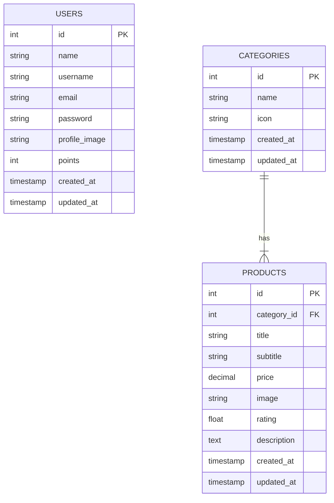

# Database Schema Design

Based on the current UI and requirements (Login, Register, CRUD Products), here is the recommended database schema.

## Entity Relationship Diagram (ERD)

## Tables Detail

### 1. Table `users`
Used for storing user information for Login and Register features.

| Column Name | Type | Constraints | Description |
| :--- | :--- | :--- | :--- |
| `id` | INT | PK, Auto Increment | Unique ID for user |
| `name` | VARCHAR(255) | NOT NULL | Full name of the user |
| `username` | VARCHAR(255) | UNIQUE, NOT NULL | Username (used for login if needed) |
| `email` | VARCHAR(255) | UNIQUE, NOT NULL | Email address (used for login) |
| `password` | VARCHAR(255) | NOT NULL | Hashed password |
| `profile_image` | VARCHAR(255) | NULL | URL/Path to profile image |
| `points` | INT | DEFAULT 0 | Loyalty points (shown in Profile UI) |
| `created_at` | TIMESTAMP | DEFAULT CURRENT_TIMESTAMP | Record creation time |
| `updated_at` | TIMESTAMP | DEFAULT CURRENT_TIMESTAMP | Record update time |

### 2. Table `categories`
Used to categorize products (e.g., Coffee, Non-Coffee, Snack).

| Column Name | Type | Constraints | Description |
| :--- | :--- | :--- | :--- |
| `id` | INT | PK, Auto Increment | Unique ID for category |
| `name` | VARCHAR(100) | NOT NULL | Category name (e.g., 'Beverages') |
| `icon` | VARCHAR(255) | NULL | Icon URL/Path for the category |
| `created_at` | TIMESTAMP | DEFAULT CURRENT_TIMESTAMP | Record creation time |
| `updated_at` | TIMESTAMP | DEFAULT CURRENT_TIMESTAMP | Record update time |

### 3. Table `products`
Used for storing product data (CRUD Product). Linked to `categories`.

| Column Name | Type | Constraints | Description |
| :--- | :--- | :--- | :--- |
| `id` | INT | PK, Auto Increment | Unique ID for product |
| `category_id` | INT | FK -> categories(id) | Foreign key to `categories` table |
| `title` | VARCHAR(255) | NOT NULL | Product name (e.g., 'Caffe Mocha') |
| `subtitle` | VARCHAR(255) | NULL | Short description or tagline |
| `price` | DECIMAL(10, 2)| NOT NULL | Product price |
| `image` | VARCHAR(255) | NULL | URL/Path to product image |
| `rating` | FLOAT | DEFAULT 0.0 | Product rating (displayed in UI) |
| `description` | TEXT | NULL | Detailed product description |
| `created_at` | TIMESTAMP | DEFAULT CURRENT_TIMESTAMP | Record creation time |
| `updated_at` | TIMESTAMP | DEFAULT CURRENT_TIMESTAMP | Record update time |

## Notes
- **Authentication**: The `users` table supports both email and username based login as seen in the code.
- **Product Categorization**: The `categories` table allows for dynamic category management (filtering in `ProductsPage`).
- **UI Alignment**:
    - `points` in `users` aligns with the "456 Pts" badge in `ProfilePage`.
    - `subtitle` in `products` aligns with the UI showing a short text below the product title.
